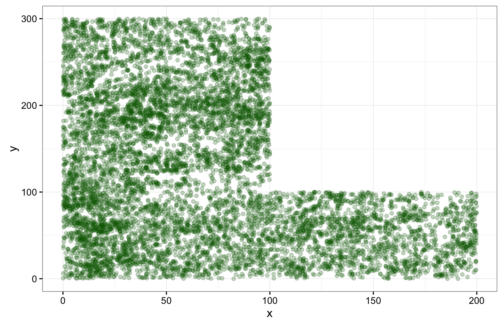
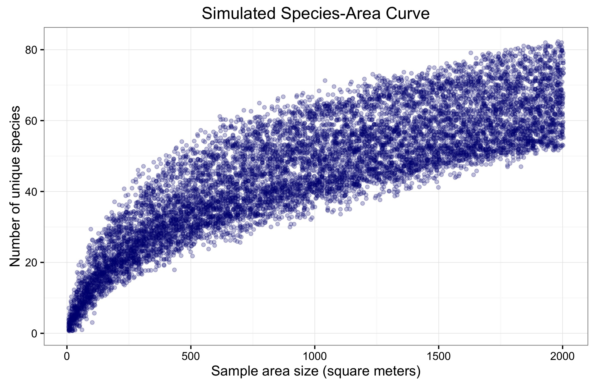

## ESPM 88B Final Project (Spring 2016)

*Note: This is an adaptation to R of a project that was originally completed in Python using the Jupyter notebook system. In the spirit of preserving the progress in this portfolio, however, the code will not be significantly altered in its function from the original project.*

The species-area curve is a means of predicting how many unique species will be found in a region of a given size. Based on the simple premise that larger areas will tend to contain more species, this curve has been thoroughly studied, examining both the factors that contribute to the shape of the curve and the usefulness of the curve. The species-area curve is sometimes used by some ecologists as a rough estimator of species loss due to habitat destruction, or for comparing species abundance on islands of varying sizes within an archipelago. 

It is worth noting that the shape of the curve is dependent on a variety of factors (elevation, rainfall, historical disruption patterns, etc.). For the sake of this project, we will focus on examining the species-area curve for a single region. This way, these additional factors are kept more or less constant, making the curve simpler to develop, but this also means that the curve we develop will have very little useful application beyond the plot it is derived from. Instead, this project is intended as an exploration of how computational techniques can be applied to examine the species-area curve. By subsampling areas of known sizes at random from a large plot containing a rather exhaustive census of all trees in the region (the Cocoli plot), a large data set is simulated to provide the basis from which a curve can be developed. This is done through transformation of the data into a linear form for which the regression techniques learned in the Foundations course can be applied.

# Cocoli

The Cocoli plot is a 4 hectare plot of land located within the Isthmus of Panama. It is classified as a semideciduous forest, receiving ~1950mm of rainfall every year (http://www.ctfs.si.edu/site/Cocoli). The plot has been thoroughly censused by the Smithsonian's Center for Tropical Forest Studies on multiple occasions, in which all trees with a stem width >= 1 cm were surveyed and recorded into a table. The data from the surveys are shown below.

This data has been provided by the Center for Tropical Forest Science and the Smithsonian Tropical Research in Panama. Citations are as follows:
Condit, R. 1998. Tropical Forest Census Plots. Springer-Verlag and R. G. Landes Company, Berlin, Germany, and Georgetown, Texas.
Hubbell, S.P., R.B. Foster, S.T. O'Brien, K.E. Harms, R. Condit, B. Wechsler, S.J. Wright, and S. Loo de Lao. 1999. Light gap disturbances, recruitment limitation, and tree diversity in a neotropical forest. Science 283: 554-557.

## Reading in the dataset

```{r setup, include=FALSE}
knitr::opts_chunk$set(echo = TRUE)
```

```{r}
library(ggplot2)
library(dplyr)
```

```{r}
cocoli <- read.csv("cocoli.txt", sep = "")
head(cocoli)
```

Fortunately, the database from which this file was downloaded included the metadata in separate files. Here is a brief summary of the Word document describing the data:

`tag`: ID # of plant

`spcode`: Abbreviated species code; full name available in cocolisp.txt

`x and y`: Coordinates in the plot, in meters. Larger x values are further east, while larger y values are further north

`dbh`: Stem sizes; -9 represents missing values

`recr`: Codes referring to status of stems (living, dead, etc.)

`pom`: Code used to indicate change in point of measurment. Some were measured at eye level, chest level, etc.

`code`: Condition of the tree; separate table describes these codes.

`mult`: Number of stems plant has at 1.3m; -9 represents missing values

`date`: Date of measurement

Now that we understand the data, we will begin developing our sampling method through which we will form a species-area relationship. The first step will be to visualize the Cocoli plot itself.

```{r}
ggplot(data = cocoli, mapping = aes(x = x, y = y)) +
  geom_point(color = "darkgreen", alpha = 0.25)
```



Conveniently, the x & y coordinates lend themselves well to being able to identify all trees within a set of given rectangular boundaries with some simple conditional statements. This will allow us to precisely count the number of species in sampled plots of known sizes; however, we will need to be ale to choose these plots' locations at random from within a larger set of predetermined boundaries.

One potential issue that arises when working with an oddly-shaped plot is the risk of sampling from an empty/nonsurveyed area. For the northeast corner, as well as the edges of the plot, we are likely to encounter this issue, which would skew our regression line.

To correct for this issue, and to simplify matters somewhat, we will focus on the largest block of data: the 3 hectares on the western side of the plot. Since each hectare is a 100m * 100m square, removing the southeastern hectare is a straightforward process.

```{r}
cocoli <- cocoli[cocoli$x <= 100,]

ggplot(data = cocoli, mapping = aes(x = x, y = y)) +
  geom_point(color = "darkgreen", alpha = 0.25)
```


From the entire 4 ha plot (40,000 m^2), we had to trim it down to a 2.65 ha rectangle. This may result in loss of some information about species located along the fringes of the plot, but will make it easier to gather more precise samples.

# Generating the data

## Developing sampling methods

Now we will develop the tools through which we can count the number of species found in varying areas of the plot. These tools will provide the data through which we will eventually construct the species-area curve.

The general premise of this method is to pick a point at random in the 100*100 grid, and then draw a boundary around it in the form of a square with the point at the center. We will then count the number of unique species within this region.

```{r}
species_counter <- function(x1, x2, y1, y2, tbl) {
  return(length(unique(tbl[x1 <= tbl$x & tbl$x <= x2
                  & y1 <= tbl$y & tbl$y <= y2,]$spcode)))
}

sampler <- function(region, size, nreps = 50) {
  
  half_edge <- sqrt(size) / 2
  x_mid <- runif(nreps, min = half_edge, max = 100 - half_edge)
  y_mid <- runif(nreps, min = half_edge, max = 100 - half_edge)
  plt <- data.frame(west = x_mid - half_edge,
                    east = x_mid + half_edge,
                    south = y_mid - half_edge,
                    north = y_mid + half_edge)
  
  return(mapply(species_counter, plt$west, plt$east, plt$south, plt$north,
                MoreArgs = list(region)))
}

## Create a higher order function so as to only require one argument:
## the size of the area for which we want to generate samples
plot_sampler <- function(tbl, n = 50) {
  return(function(area_size) 
    {sampler(region = tbl, size = area_size, nreps = n)})
}

```

```{r}
set.seed(1234)

values <- data.frame(
  sample_area = c(rep(seq(10, 2000, by = 10), each = 50))
)

values$species_count <- sapply(values$sample_area, plot_sampler(cocoli, n = 1))

## Filter out zeroes so as to enable log transformation later on
values <- values[values$species_count != 0,]
```

```{r}
ggplot(data = values, mapping = aes(x = sample_area, y = species_count)) +
  geom_jitter(color = "navy", size = 1.25, alpha = 0.25) + 
  labs(x = "Sample area size (square meters)", y = "Number of unique species") +
  ggtitle("Simulated Species-Area Curve") +
  theme_bw()
```



# Regression Analysis

Now that we have collected the data through our simulation, we must develop a curve that best fits the data. From the plot of the data shown above, it is visually apparent that there is a strong association between the sample area and number of species in a sample. However, that association does not appear to be linear. As such, logarithmic transformations will be necessary to create a regression line.

```{r}
values$log_ar <- log10(values$sample_area)
values$log_ct <- log10(values$species_count)

ggplot(data = values, mapping = aes(x = log_ar, y = log_ct)) +
  geom_jitter(color = "navy", size = 1.25, alpha = 0.15) + 
  labs(x = "Log sample area size", y = "Log # of unique species")
```


```{r}
## Write in some functions needed for regression analysis

correlation <- function(x, y) {
  return(mean(scale(x) * scale(y)))
}

slope <- function(x, y) {
  r <- correlation(x,y)
  return(r * sd(y) / sd(x)) 
}

intercept <- function(x, y) {
  a = slope(x, y)
  return(mean(y) - a * mean(x))
}

regr_stats <- function(t, x, y) {
  r <- correlation(x, y)
  m <- slope(x, y)
  b <- intercept(x, y)
  print(paste('r =         ', signif(r, digits = 4)))
  print(paste('r_squared = ', signif(r ^ 2, digits = 4)))
  print(paste('slope =     ', signif(m, digits = 4)))
  print(paste('intercept = ', signif(b, digits = 4)))
  
  ggplot(data = t, mapping = aes(x, y)) +
    geom_point(color = "navy", size = 1.25, alpha = 0.15) +
    geom_segment(aes(x = 0, xend = max(x), y = b, yend = max(x) * m),
                 color = "red") +
    theme_bw()
}
```

```{r}
regr_stats(t = values, x = values$log_ar, y = values$log_ct)
```


We now have a regression line, and know its key statistics. However, this regression line is given in log-log units; it will be much more useful to convert our prediction line back into original units. To do so, we can form a set of predictions in original units; this is slightly less precise, but will suffice for the sake of visualization. The algebra behind this conversion is shown below:

log(y) = m(log(x)) + b = log(x^m) + b

y = 10b ^ * x ^ m

```{r}
predicted_value <- function(x, y) {
  return(slope(x, y) * x + intercept(x, y))
}

values$pred_log <- predicted_value(values$log_ar, values$log_ct)

values$pred_reg <- (10 ^ intercept(values$log_ar, values$log_ct) *
                      values$sample_area ^ slope(values$log_ar, values$log_ct))
```

```{r}
ggplot(data = values) +
  geom_jitter(aes(x = sample_area, y = species_count), 
             color = "darkblue", size = 1.25, alpha = 0.25) +
  geom_line(aes(x = sample_area, y = pred_reg), color = "red", size = 2) +
  labs(x = "Sample area size (square meters)", y = "Number of unique species") +
  ggtitle("SAC with Prediction Line") +
  theme_bw()
```


This regression line, once converted to original units, seems reasonable. However, it appears to underpredict species counts at lower sample areas, and overpredict species counts at higher sample areas. To check this suspicion, we will again look at a residual plot, this time in original units.
