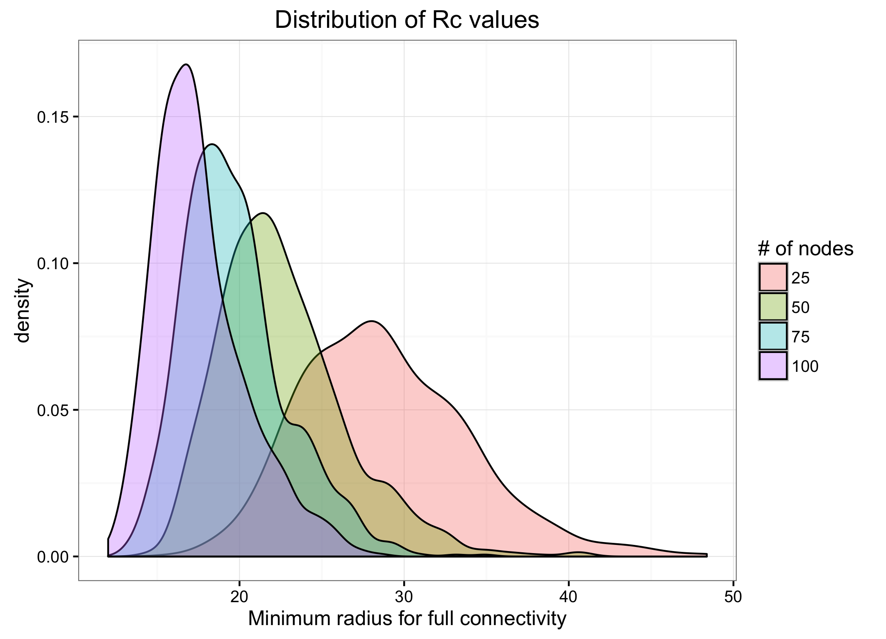
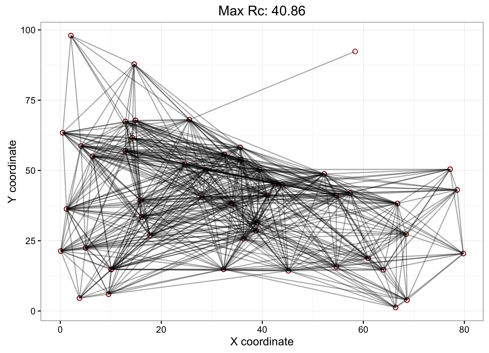

```{r setup, include=FALSE}
knitr::opts_chunk$set(echo = TRUE)
```

In this project, our task was to simulate an ad-hoc cellular network; e.g., given a population density map, what signal strength is needed for each individual's cellular device to be able to communicate with all other individuals? We wanted to find the minimum radius of signal strength such that a given network is fully connected. 

## Phase I: Generating nodes

```{r density function}
## This code chunk was provided by our instructor; the rest is our own work.

nodeDensity <- function (x, y) {
# x is a numeric vector 
# y is a numeric vector the same length as x
# z is returned. 
# It is a numeric vector that provides the value of the node density function

# Check the inputs for the correct format
if (mode(x) != "numeric" | mode(y) != "numeric") stop("x and y must be numeric")
if (length(x) != length(y)) stop("x and y must be same length")

  a = 3
  b = 1
  band = 15 
  bank = 1
  inBoundary = (0 <= x & x <= 100) & 
             (0 <= y & y <= 100 & y < sqrt(110^2 - x^2))

  river = abs(sqrt(x^2 + y^2) - 60) 
  hiArea = river> bank & river < band & inBoundary

  hiDensity = a * cos(river[hiArea] * pi / (2 * band)) + b 

  z = b * inBoundary
  z[hiArea] = hiDensity
  z[river <= bank] = 0 
  z
}
```

```{r genNodes}
## Find maximum z value for sake of random point generation
x <- seq(0, 100, length = 200)
y <- seq(0, 100, length = 200)
gridPts <- expand.grid(x, y)
zMax <- max(nodeDensity(gridPts$Var1, gridPts$Var2)) + 0.02

genNodes <- function(n) {
  ## Generates N nodes at random from the provided density curve. Returns matrix of x&y coordinates.

  ## Generate 3D points at random; 5*n is gratuituous but not significantly slower
  xCoords <- runif(n * 5, min = 0, max = 100)
  yCoords <- runif(n * 5, min = 0, max = 100)
  zCheck <- runif(n * 5, min = 0, max = zMax)
  
  ## Determine which points lie BENEATH density curve
  keep <- nodeDensity(xCoords, yCoords) >= zCheck
  
  ## Construct a matrix of points meeting criteria   
  xCoords <- xCoords[keep]
  yCoords <- yCoords[keep]
  nodeMat <- cbind(xCoords, yCoords)
  
  ## Check that enough valid nodes remain
  if(nrow(nodeMat) >= n) {
    return(nodeMat[1:n,])
  } else {
      return(genNodes(n)) ## Recursively try again if not enough nodes this time
  }
}
```

Admittedly, generating `zMax` outside of `genNodes` is less than ideal from a communicative standpoint. However, this will become important later on, as when we generate 4000 sets of nodes, we do not want to unecessarily run this series of functions each time.

```{r checks}
## Some checks that genNodes works as expected
dim(genNodes(1000)) ## Should be 1000 x 2

mean(genNodes(1000)[,1]) ## Around 40-50

head(genNodes(1000)) ## Points should be different and random
```


## Phase II: Calculating critical radius (Rc)

To determine whether a network is connected for a given signal strength, the method suggested to us was to form a transition matrix. If, by means of a random walk, a message is able to reach all other nodes on the network, then the network's transition matrix has a single steady state solution. If the network is not fully connected, then the partial set of nodes that a message can travel to is dependent on the message's starting point.

### Helper functions
```{r findRange}
findRange <- function(mat) {
  ## Takes a matrix MAT of distances between nodes to determine the
  ## values to set as lower and upper bounds when searching for Rc.
  
  if (typeof(mat) != "double") {stop ("Input must be a numeric matrix")}
  
  ## Matrix whose columns are the sorted distance for each row
  ## finds the lower bound of the range by taking the maximum 
  ## of the row-wise minimums (excluding 0) 
  ## find the upper bound of the range by taking the minimum 
  ## of the row-wise maximums
  lower <- max(apply(mat, 1, function(row_vec) {
    min(row_vec[row_vec!=0])
  }))
  upper <- min(apply(mat, 1, max))
  
  return (c(lower, upper))
}
```

```{r findTranMat}
findTranMat <- function(mat, r) {
  ## Given a distance matrix MAT and signal strength R, finds the transition matrix
  ## used to determine random walks.
  return(t(apply(mat, 1, function(vec) {
    return(((vec <= r) + 0) / (sum((vec <= r) + 0)))
  })))
}
```

```{r getEigen2}
getEigen2 <- function(mat) {
  ## Computes the second eigenvalue of a matrix MAT.
  return(Mod(eigen(mat, only.values = TRUE)$values)[2])
}
```

### The primary function: findRC
```{r findRC}
findRC <- function(nodes, tol = 0.05, epsilon = 0.001) {
  ## Iteratively attempts different R values to estimate the true minimum R value
  ## at which the network of NODES is fully connected, within a tolerance TOL.
  ## EPSILON is the max margin of error for getEigen2 such that it approx. = 1.
  
  dists <- as.matrix(dist(nodes, diag = TRUE, upper = TRUE))
  
  bounds <- findRange(dists)
  upper <- bounds[2]
  lower <- bounds[1]
  
  while (upper - lower > tol) {
  
  guess <- (upper + lower) / 2 ## Midpoint of bounds
  isConnected <- getEigen2(findTranMat(dists, guess)) <= 1 - epsilon
  
    if (isConnected) {  ## We know that Rc <= this guess
        upper <- guess
        
  } else { ## Rc >= guess
        lower <- guess
  }}
  
  return (upper)
}

```
  
*On our criteria for narrowing the search range:* We always know that the network is connected at our upper bound; we also always know that the network is not connected at our lower bound. Thus, we know that the true minimum radius ("Rc") lies between the lower and upper bounds. 

Because we have exited the while loop, we know that the distance between our lower and upper bound is within the allowed tolerance.

Therefore, the distance between Rc and the upper bound is within the allowed tolerance, and the network is fully connected at the upper bound. Our BEST guess for R that still forms a fully connected network is the final value for the upper bound.


## Phase III: Analyzing Rc

```{r generate values}
## Set seed to index of the matrix before generating randomly; 
## simplifies identifying matrices later on.
RCvalues50 <- sapply(seq(1:1000), function(i){
  set.seed(i)
  findRC(genNodes(50))
})

## Generate all other matrices at random; we only need consistency for N = 50
## so that we can plot our four representative matrices later on.
RcVals <- data.frame(
            Rc = c(replicate(1000, findRC(genNodes(25))),
                   RCvalues50,
                   replicate(1000, findRC(genNodes(75))),
                   replicate(1000, findRC(genNodes(100)))),
            n = c(rep(25, 1000),
                  rep(50, 1000), 
                  rep(75, 1000),
                  rep(100, 1000))
)

```

To simplify result replication when plotting networks later on, we chose to set the seed for each network (for `n` = 50) to its index number. However, for the other three `n` values, we are not so concerned with slight variations, so seed setting is not important in these cases.

```{r plot RC vals}
library(ggplot2)
library(gridExtra)

## Specify N as factor
RcVals$n <- factor(RcVals$n)

ggplot(data = RcVals) +
  geom_density(aes(x = Rc, group = n, fill = n), alpha = 0.33) +
  guides(fill = guide_legend("# of nodes")) +
  ggtitle("Distribution of Rc values") +
  labs(x = "Minimum radius for full connectivity") +
  theme_bw()
```



### Examining the distribution of Rc

Rc changes in such a way that when there are more nodes, the spread of minimum radii for full connectivity is smaller. Furthermore, the mean radius decreases logorithmically as the number of nodes increases.

The distribution of Rc values is right-tailed for each `n` value. With a higher n value, the spread of the Rc values decreases. Additionally, there is a small second peak in each distribution occuring right of the mode of the distribution, but this peak is less prominent for greater `n` values.

```{r plot networks}
plotNetwork <- function(seed, RC, n = 50) {
  ## Given a SEED and its RC value, plots the associated network.
  
  set.seed(seed)
  nodes <- data.frame(genNodes(n))
  distNodes <- as.matrix(dist(nodes))
  connPairs <- which(distNodes <= RC, arr.ind = TRUE)
  pairs <- data.frame(
            x1 = nodes[connPairs[,1], 1],
            y1 = nodes[connPairs[,1], 2],
            x2 = nodes[connPairs[,2], 1],
            y2 = nodes[connPairs[,2], 2])
  
  ggplot(data = pairs) +
    geom_point(aes(x1, y1), shape = 1, size = 2, color = "darkred") +
    geom_segment(aes(x = x1, y = y1,
                     xend = x2, yend = y2), alpha = 0.2) +
    labs(x = "X coordinate", y = "Y coordinate") +
    theme_bw()
}
```

### Rationale behind the plotting function

As stated before, we use the random seed as an input to reduce memory usage (we do not need to store all 1000 network matrices this way). We use this seed to generate its associated network, and from the network construct a new data frame of pairs of nodes whose distance is less than the network's Rc value. Because the network is fully connected, we know that all nodes will appear in this data frame; redundancies do not significantly slow down the runtime of the function.

```{r}
## Find the seed & RC associated with representative
## network for each summary statistic

medSeed <- which(RCvalues50 == sort(RCvalues50)[500])
medRC <- RCvalues50[medSeed]

meanSeed <- which(abs(mean(RCvalues50) - RCvalues50) == 
                  min(abs(mean(RCvalues50) - RCvalues50)))
meanRC <- RCvalues50[meanSeed]

minRC <- min(RCvalues50)
minSeed <- which(RCvalues50 == minRC)

maxRC <- max(RCvalues50)
maxSeed <- which(RCvalues50 == maxRC)

grid.arrange(
  (plotNetwork(minSeed, minRC) + ggtitle(paste("Minimum Rc:", signif(minRC, digits = 4)))),
  (plotNetwork(meanSeed, meanRC) + ggtitle(paste("Mean Rc:", signif(meanRC, digits = 4)))),
  (plotNetwork(medSeed, medRC) + ggtitle(paste("Median Rc:", signif(medRC, digits = 4)))),
  (plotNetwork(maxSeed, maxRC) + ggtitle(paste("Max Rc:", signif(maxRC, digits = 4)))),
  nrow = 2, ncol = 2
  )
```


### Comparing the four networks

It appears that the more evenly the nodes are spread across the 100 x 100 grid, the smaller the Rc value. This is especially true when comparing the minimum Rc network to the mean and median networks; the greater spread across the grid for the former significantly decreases its minimum radius of connectivity.

The final network, corresponding to the maximum radius of connectivity for our simulation, has a rather interesting shape. All but one of its points essentially lie along the "banks" of the river in the contour plot used to generate the nodes. However, the single node that lies a large distance away from all the others necessitates a large Rc value, which enables the rest of the network to have a significantly larger amount of possible connections between the remaining nodes.
